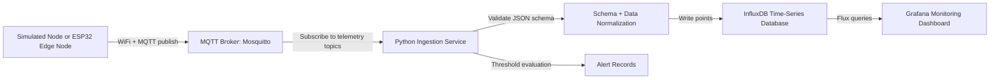

# Distributed Radiation Sensing Network — Prototype Architecture

## Goal

Build a hardware-independent software pipeline that can receive readings from many distributed detector nodes, store the readings as time-series telemetry, and visualize the state of the network in a dashboard.

The first prototype uses simulated radiation nodes and/or ESP32 + DHT22 nodes. When the real radiation detector hardware is ready, it only needs to publish the agreed MQTT topic and JSON payload.

## Architecture



## Topic Contract

Telemetry messages use this topic pattern:

```text
radiation/{site_id}/{node_id}/telemetry
```

Examples:

```text
radiation/utd-test-lab/detector-001/telemetry
radiation/utd-test-lab/esp32-dht22-001/telemetry
```

Future topic extensions:

```text
radiation/{site_id}/{node_id}/status
radiation/{site_id}/{node_id}/alerts
radiation/{site_id}/{node_id}/config
radiation/{site_id}/{node_id}/command
```

## Payload Contract

All nodes should publish a JSON payload with stable metadata and a flexible `reading` object:

```json
{
  "node_id": "detector-001",
  "site_id": "utd-test-lab",
  "timestamp": "2026-06-06T16:20:00Z",
  "sensor_type": "simulated-radiation",
  "reading": {
    "dose_rate_usv_h": 0.14,
    "counts_per_second": 38,
    "gamma_current": 0.14,
    "gamma_average": 0.12,
    "gamma_max": 0.21,
    "neutron_detected": false
  },
  "battery_pct": 91,
  "rssi": -62,
  "status": "ok",
  "sequence": 42
}
```

The `reading` object is intentionally flexible so DHT22 simulation, GM tube output, scintillator/spectrum output, or processed detector values can fit without redesigning the backend.

## Service Responsibilities

### Edge Node

- Reads sensor/detector values.
- Adds node ID, site ID, timestamp, status, sequence number, and optional health metrics.
- Publishes JSON telemetry to MQTT.

### MQTT Broker

- Receives messages from many nodes.
- Decouples edge devices from backend storage and dashboard services.
- Provides topic-based routing.

### Ingestion Service

- Subscribes to telemetry topics.
- Parses JSON.
- Validates against `schema/telemetry.schema.json`.
- Normalizes flexible readings into InfluxDB fields.
- Adds simple alert level records based on dose-rate thresholds.

### InfluxDB

- Stores append-only timestamped sensor telemetry.
- Enables queries by time window, node, site, sensor type, and field.

### Grafana

- Displays live time-series charts.
- Shows latest alert levels.
- Shows basic node health such as battery and RSSI.

## Initial Alert Threshold Placeholders

The prototype uses configurable placeholder thresholds:

| Level | Condition | Meaning |
|---|---:|---|
| 0 | `dose_rate_usv_h <= 0.3` | Normal/background |
| 1 | `> 0.3` | Warning |
| 2 | `> 1.0` | Very dangerous placeholder |
| 3 | `> 100.0` | Extreme placeholder |

These values should be confirmed with the research/hardware team before real use.

## Why This Design Is Easy to Extend Later

1. The detector does not need to know about InfluxDB or Grafana.
2. The MQTT topic and JSON schema form the integration contract.
3. The `reading` object supports new radiation-specific fields later.
4. The ingestion service can be modified without changing ESP32/detector firmware.
5. Grafana can be replaced by a custom dashboard later if needed.

## Future Production Improvements

- MQTT authentication, access control lists, and TLS.
- Device registry table for metadata, calibration, ownership, and deployment location.
- Store raw spectrum arrays separately if high-volume spectral data is needed.
- Dead-letter topic or error bucket for invalid messages.
- Offline buffering on edge nodes.
- Cloud deployment or local gateway + cloud sync architecture.
- Real alert notifications through email, SMS, Slack, or university-approved notification channels.
